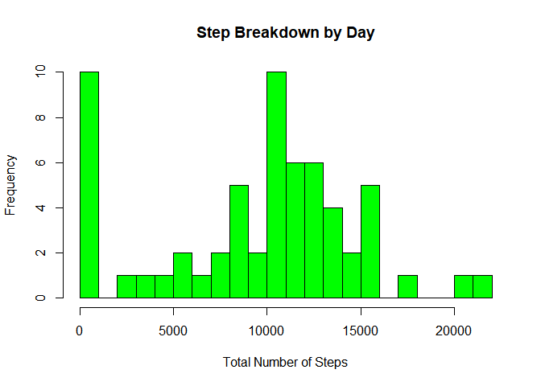
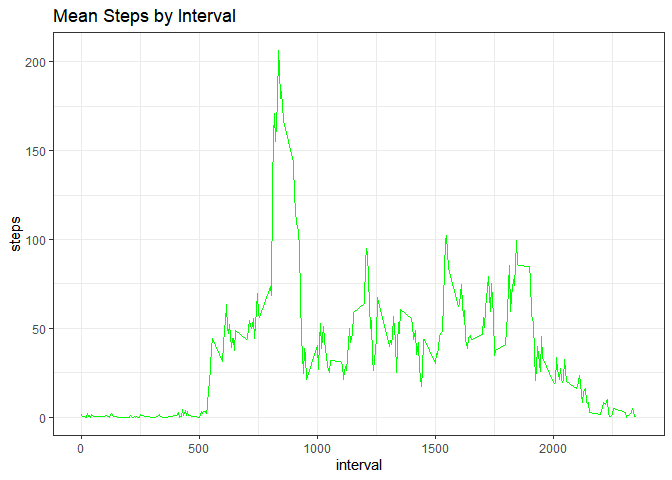
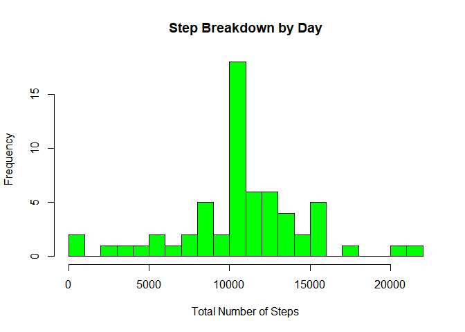
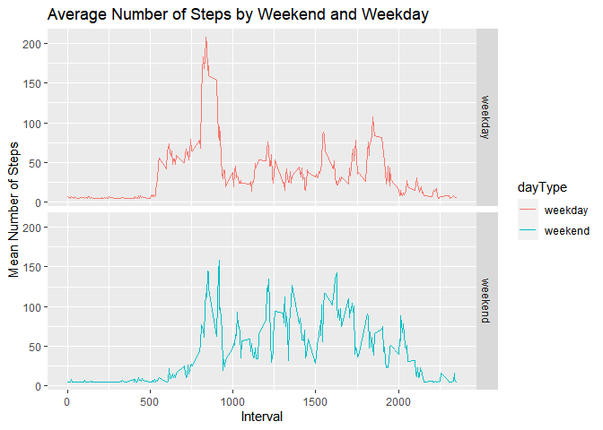

```r
library(data.table)
library(ggplot2)
library(dplyr)
```

```
## 
## Attaching package: 'dplyr'
```

```
## The following objects are masked from 'package:data.table':
## 
##     between, first, last
```

```
## The following objects are masked from 'package:stats':
## 
##     filter, lag
```

```
## The following objects are masked from 'package:base':
## 
##     intersect, setdiff, setequal, union
```

## Loading and preprocessing the data

```r
unzip('activity.zip')
activity<-data.table(read.csv(file='activity.csv', header = T))
activity[, date:=as.Date(date, format='%Y-%m-%d')]
head(activity)
```

```
##    steps       date interval
## 1:    NA 2012-10-01        0
## 2:    NA 2012-10-01        5
## 3:    NA 2012-10-01       10
## 4:    NA 2012-10-01       15
## 5:    NA 2012-10-01       20
## 6:    NA 2012-10-01       25
```


## What is mean total number of steps taken per day?

```r
TotalNumberOfSteps<-activity[, list(total_steps=sum(steps, na.rm = T)), by='date']
hist(TotalNumberOfSteps$total_steps, 
     main="Step Breakdown by Day" ,
     xlab='Total Number of Steps',
     col="green",
     breaks = 20)
```

<!-- -->

```r
meanSteps<-mean(TotalNumberOfSteps$total_steps, na.rm = T)
medianSteps<-median(TotalNumberOfSteps$total_steps, na.rm = T)
paste('The mean number of steps is', meanSteps)
```

```
## [1] "The mean number of steps is 9354.22950819672"
```

```r
paste('The median number of steps is', medianSteps)
```

```
## [1] "The median number of steps is 10395"
```

## What is the average daily activity pattern?

```r
average_steps<-activity[!is.na(steps),list(steps=mean(steps)), by='interval']
average_steps[ ,steps:=as.numeric(steps)]
p1<-ggplot(data=average_steps, aes(x=interval, y=steps)) + 
        geom_line(color='green')+
        theme_bw()+
        ggtitle('Mean Steps by Interval')
print(p1)
```

<!-- -->

```r
max_step<-max(average_steps$steps)
max_interval<-average_steps[steps==max_step,]
max_interval<-max_interval$interval
paste(max_interval, 'is the interval that contains the max number of steps which is', max_step)
```

```
## [1] "835 is the interval that contains the max number of steps which is 206.169811320755"
```


## Imputing missing values
### Empty values in this data set have been replaced by the meanInterval

```r
empty_row<-nrow(activity[is.na(steps),])
meanInterval<-mean(activity$steps, na.rm=T)
data_fill<-activity[, steps:=ifelse(is.na(steps), meanInterval, steps)]
updateNumberSteps<-data_fill[, list(total_steps=sum(steps, na.rm = T)), by='date']
updateMeanStep<-mean(updateNumberSteps$total_steps)
updatemediaStep<-median(updateNumberSteps$total_steps)

hist(updateNumberSteps$total_steps, 
     main="Step Breakdown by Day" ,
     xlab='Total Number of Steps',
     col="green",
     breaks = 20)
```

<!-- -->
##With the empty values replaced, the updated mean and median values are

```r
paste(updateMeanStep, 'and', updatemediaStep,'respectively')
```

```
## [1] "10766.1886792453 and 10766.1886792453 respectively"
```
###This is a slight elevation on both values

## Are there differences in activity patterns between weekdays and weekends?

```r
weekdayOrWeekend<-copy(data_fill)
weekdayOrWeekend[,day:=weekdays(date)]
daytype<-c('Saturday','Sunday')
weekdayOrWeekend[,dayType:=as.factor(ifelse(day %in% daytype, 'weekend','weekday'))]
weekdayOrWeekend<-weekdayOrWeekend[, list(mean_steps=mean(steps)), by=c('interval','dayType')]

p2<-ggplot(weekdayOrWeekend, aes(x=interval, y=mean_steps, color=dayType)) + 
        geom_line()+
        xlab("Interval") + 
        ylab("Mean Number of Steps") +
        ggtitle("Average Number of Steps by Weekend and Weekday")+
        facet_grid(dayType ~.)
print(p2)
```

<!-- -->


